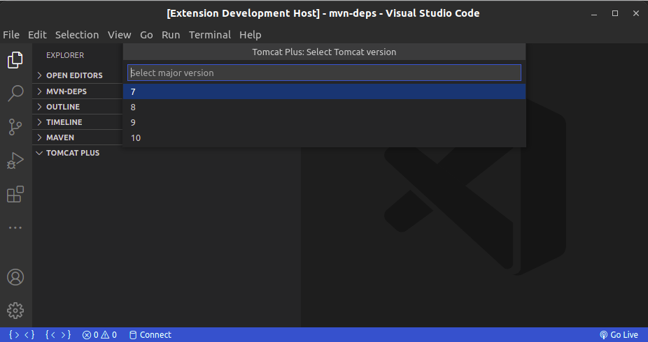
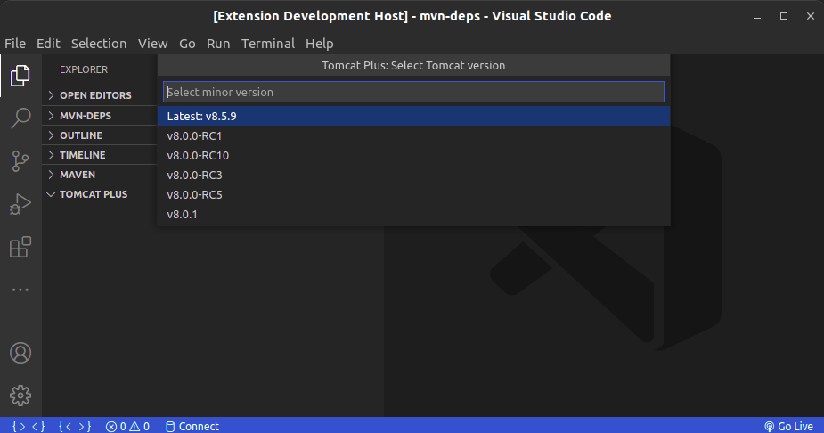
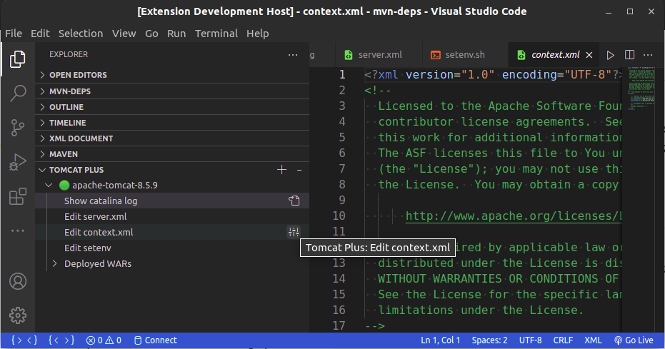
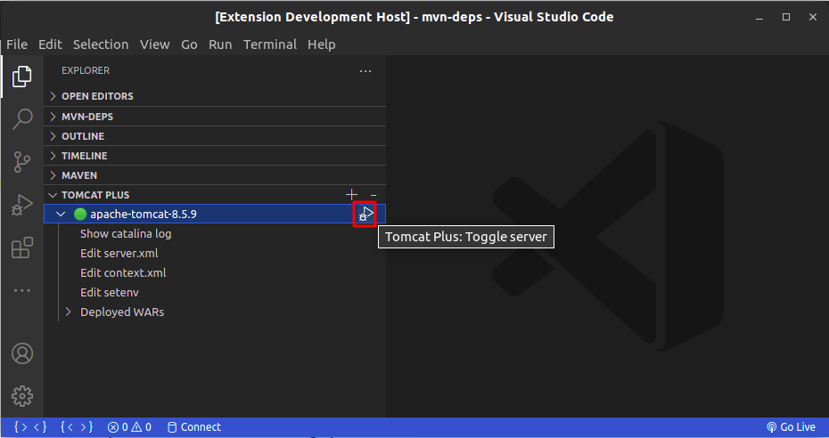
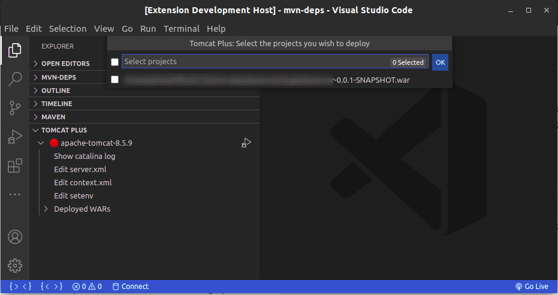
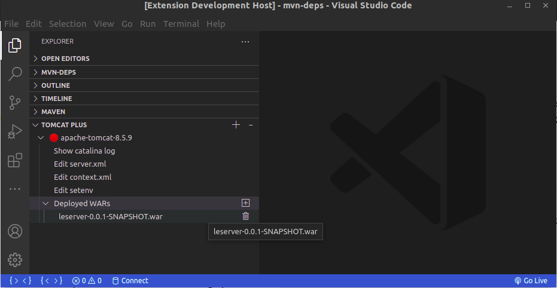

# tomcat-plus README

  
A Visual Studio Code extension that allows the user to download, install and manage multiple tomcat servers, edit its configurations and add/remove WARs to it. 

  

## Features

  

 - Download/Add Tomcat server straight from Apache:
 
 

 -  Edit configuration files:
 

- Start/Stop server
 

- Add WARs to deployment
 
 
  

## Requirements

  - [Java](https://www.java.com/)
  - [Debugger for Java](https://marketplace.visualstudio.com/items?itemName=vscjava.vscode-java-debug)

  
## Known Issues

  

- No loader for downloads/slow tasks
- Only works on Linux and maybe MacOS
  

## Release Notes

  

### 0.1.0

Initial release

### Disclaimer

This is very much a work in progress, and I made this because [adashen's](https://marketplace.visualstudio.com/items?itemName=adashen.vscode-tomcat) doesn't quite do everything I want. I'll be adding functionality and fixing bugs whenever I can, and I'll do my best to keep it updated.

**Happy coding! 🤓☕**